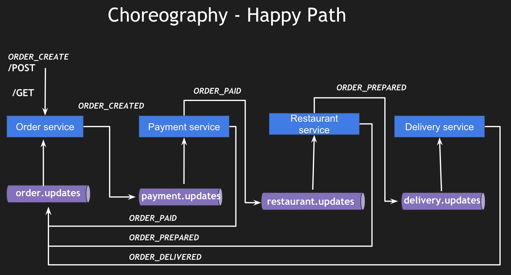

# SAGA Implementation Example
This repo has the list of implementation details (branches) for each part (except Part 1) for SAGA using Spring Boot, 
Amazon DynamoDB, Amazon SQS and Amazon EKS.

# Table of Contents
- [Part 1 - Requirements & Architecture](https://www.youtube.com/watch?v=WbNJTwKOCuM)
- [Part 2 - Creating order-service code sample](https://github.com/TechPrimers/saga-choreography-example/tree/part-2-order-service)

## Architecture
